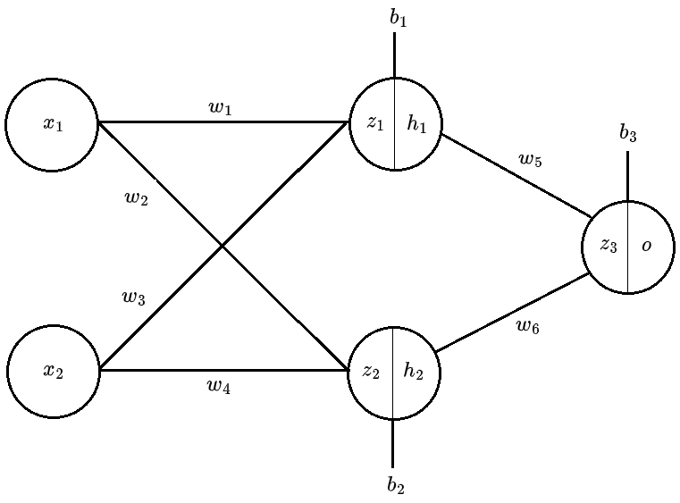

# Neural network demonstration

This repository contains an implementation of a simple neural network that solves the XOR problem. The network is written in Python using only NumPy library. The main motivation for this project was to learn the basics of backpropagation. Below is an image of the network implemented and formulas for the gradients used in backpropagation.

## Graphical representation of the neural network

## Gradients for the output layer

$$
\frac{\partial C}{\partial w_5}
= \frac{\partial C}{\partial\hat{y}}
\cdot \frac{\partial\hat{y}}{\partial z_3}
\cdot \frac{\partial z_3}{\partial w_5}
$$

$$
\frac{\partial C}{\partial w_6}
= \frac{\partial C}{\partial\hat{y}}
\cdot \frac{\partial\hat{y}}{\partial z_3}
\cdot \frac{\partial z_3}{\partial w_6}
$$

$$
\frac{\partial C}{\partial b_3}
= \frac{\partial C}{\partial\hat{y}}
\cdot \frac{\partial\hat{y}}{\partial z_3}
\cdot \frac{\partial z_3}{\partial b_3}
$$

## Gradients for the hidden layer

$$
\frac{\partial C}{\partial w_1}
= \frac{\partial C}{\partial\hat{y}}
\cdot \frac{\partial\hat{y}}{\partial z_3}
\cdot \frac{\partial z_3}{\partial h_1}
\cdot \frac{\partial h_1}{\partial z_1}
\cdot \frac{\partial z_1}{\partial w_1}
$$

$$
\frac{\partial C}{\partial w_2}
= \frac{\partial C}{\partial\hat{y}}
\cdot \frac{\partial\hat{y}}{\partial z_3}
\cdot \frac{\partial z_3}{\partial h_2}
\cdot \frac{\partial h_2}{\partial z_2}
\cdot \frac{\partial z_2}{\partial w_2}
$$

$$
\frac{\partial C}{\partial w_3}
= \frac{\partial C}{\partial\hat{y}}
\cdot \frac{\partial\hat{y}}{\partial z_3}
\cdot \frac{\partial z_3}{\partial h_1}
\cdot \frac{\partial h_1}{\partial z_1}
\cdot \frac{\partial z_1}{\partial w_3}
$$

$$
\frac{\partial C}{\partial w_4}
= \frac{\partial C}{\partial\hat{y}}
\cdot \frac{\partial\hat{y}}{\partial z_3}
\cdot \frac{\partial z_3}{\partial h_2}
\cdot \frac{\partial h_2}{\partial z_2}
\cdot \frac{\partial z_2}{\partial w_4}
$$

$$
\frac{\partial C}{\partial b_1}
= \frac{\partial C}{\partial\hat{y}}
\cdot \frac{\partial\hat{y}}{\partial z_3}
\cdot \frac{\partial z_3}{\partial h_1}
\cdot \frac{\partial h_1}{\partial z_1}
\cdot \frac{\partial z_1}{\partial b_1}
$$

$$
\frac{\partial C}{\partial b_2}
= \frac{\partial C}{\partial\hat{y}}
\cdot \frac{\partial\hat{y}}{\partial z_3}
\cdot \frac{\partial z_3}{\partial h_2}
\cdot \frac{\partial h_2}{\partial z_2}
\cdot \frac{\partial z_2}{\partial b_2}
$$
